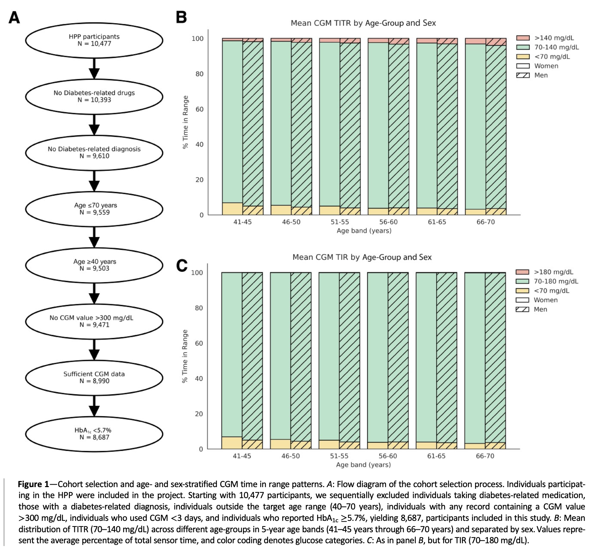
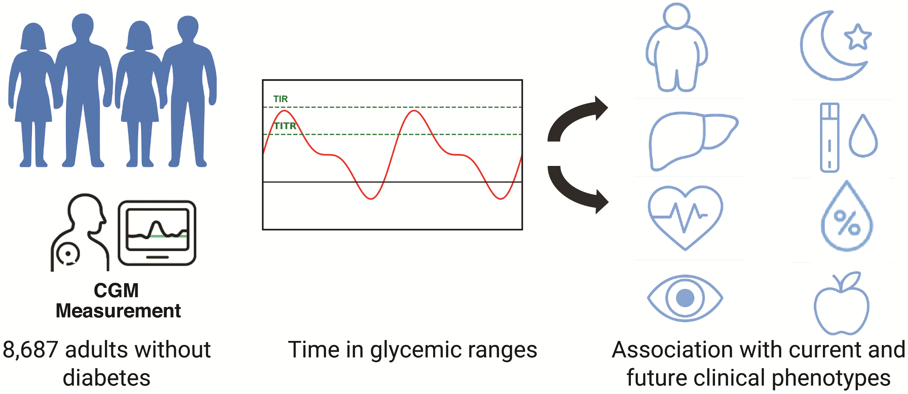

Godneva A, Phillip M, Segal E, Shilo S, [*Diabetes Care*](https://doi.org/10.2337/dc25-2154)

## Paper summary

 

**OBJECTIVE**

To characterize the distribution of time in tight and broader glycemic ranges in adults without diabetes and to examine cross-sectional and longitudinal associations with metabolic health.

**RESEARCH DESIGN AND METHODS**

We analyzed continuous glucose monitoring data from 8,687 adults (40–70 years, 54% women) in the Human Phenotype Project, each contributing 1,149 ± 279 glucose readings from FreeStyle Libre Pro sensors. Age- and sex-adjusted correlations linked time-in-range metrics with 45 clinical phenotypes encompassing adiposity, vascular, and liver markers, sleep indices, and nutrition. Cox models tested associations of time above glycemic thresholds with incident metabolic disease over 2.6 ± 1.3 years.

**RESULTS**

Participants spent a median 93.0% (interquartile range [IQR] 91.8–98.2) of continuous glucose monitor time within 70–140 mg/dL and 95.2% (IQR 95.1–99.8) within 70–180 mg/dL. Time <140 mg/dL and 180 mg/dL was 97.7% (IQR 97.6–97.8) and 99.9% (IQR 99.9–99.9), respectively. Lower time <140 mg/dL correlated with higher waist circumference, visceral fat, triglycerides, blood pressure, serum ALT, and liver attenuation, and with lower HDL cholesterol and mean nocturnal oxygen saturation. Associations weakened using the <180 mg/dL threshold. Lower time <180 mg/dL and <140 mg/dL was associated with higher risk of incident metabolic disease (hazard ratio 1.21 [95% CI 1.15–1.26] and 1.34 [95% CI 1.26–1.42], respectively).

**CONCLUSIONS**

We provide population references for time spent in different glycemic ranges by adults without diabetes. Although our study is observational and not designed to establish causality, our findings suggest that even within normoglycemic ranges, less time <140 mg/dL is associated with unfavorable health parameters and higher incident metabolic disease risk.

 

 

