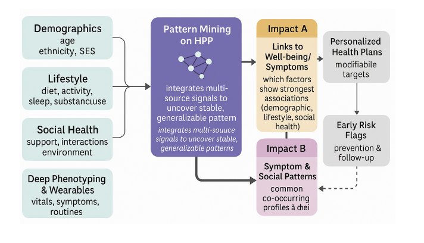

Arun Menon N, Islam M, Bouadjenek M, Jameel S, Segal E, Razzak I, [*medRxiv *](http://doi.org/10.64898/2026.02.09.26345884)

 

## Paper summary 

Loneliness and psychological well-being are increasingly recognized as critical public health concerns, yet their multi factorial determinants remain poorly understood. Traditional research often examines demographic, lifestyle, or social variables in isolation, yielding fragmented insights that overlook complex psychosocial interactions. In this study, we leverage a rich behavioral and psychological dataset from the Human Phenotype Project (HPP) to examine how lifestyle behaviors, social health indicators, and demographic characteristics collectively influence mental health outcomes. Employing advanced machine learning (ML) methods, including feature engineered representations, classical predictive models, and Large Language Model (LLM) classifiers, we identify latent psychosocial patterns associated with loneliness and psychological symptoms. Our approach combines predictive performance with interpretability, enabling the identification of key drivers of well-being across heterogeneous populations. Results indicate that certain lifestyle and social engagement factors consistently correlate with lower loneliness and improved psychological health, while other influences are context-dependent. This work demonstrates the potential of integrating computational modeling with psychological theory to reveal complex, multidimensional determinants of mental health, offering insights for targeted interventions, digital health applications, and evidence-based public health strategies.

