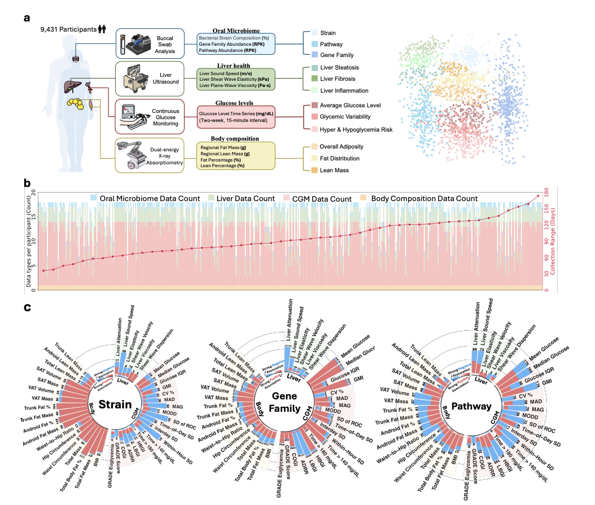

Xue H, Godneva A, Tang F, Li H, Li Y, Hu M, Li R, Su J, Segal E, Razzak I, [*NeurIPS*](https://www.biorxiv.org/content/10.1101/2025.10.28.685004v1.abstract)

 

## Paper summary 

The oral microbiome may capture system-specific information about host metabolic health, yet large-scale, multi-system evidence remains scarce. We analyzed 9,431 participants in the Human Phenotype Project (HPP), integrating oral whole-metagenome profiles with 44 metabolic measures spanning liver ultrasound, continuous glucose monitoring (CGM), and dual-energy X-ray absorptiometry (DXA). A multilayer map across strains, gene families and pathways revealed widespread associations: 213 strains, 124,603 gene families and 299 pathways were significantly associated with metabolic measures. Prioritizing the strongest and cross-phenotype signals, we identified multiple oral features that exhibit multifaceted and significant associations with metabolic health. For example, acyl carrier protein (ACP) associated with lower liver inflammation and reduced adiposity, whereas polyamine biosynthesis and ceramide α-oxidation tracked higher glucose variability and adverse liver and adiposity phenotypes. We further trained disease prediction models using only oral features that were significantly associated with the clinical phenotypes of each disease; compared with models using the full feature set, these models consistently achieved higher performance across six metabolic diseases. Together, these findings provide reproducible evidence for future research and highlight the potential of oral microbial markers as non-invasive tools for metabolic risk stratification and as promising targets for microbiome-based interventions in metabolic diseases.

