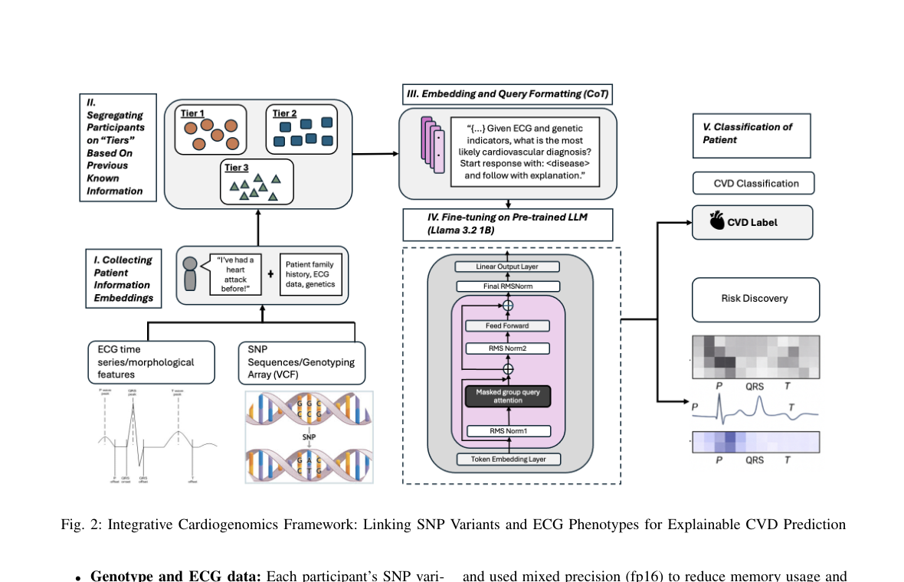

Menon N, Farooq I, Li Y, Ahmed S, Xie Y, Cvssp M, Razzak I, [*arXiv preprint*](http://doi.org/10.1109/BIBM66473.2025.11356325  )

 

 

## Paper summary 

Cardiovascular disease (CVD) prediction remains
a tremendous challenge due to its multifactorial etiology and
global burden of morbidity and mortality. Despite the growing
availability of genomic and electrophysiological data, extracting
biologically meaningful insights from such high-dimensional,
noisy, and sparsely annotated datasets remains a non-trivial task.
Recently, LLMs has been applied effectively to predict structural
variations in biological sequences. In this work, we explore the
potential of fine-tuned LLMs to predict cardiac diseases and
SNPs potentially leading to CVD risk using genetic markers
derived from high-throughput genomic profiling. We investigate
the effect of genetic patterns associated with cardiac conditions
and evaluate how LLMs can learn latent biological relationships
from structured and semi-structured genomic data obtained by
mapping genetic aspects that are inherited from the family tree.
By framing the problem as a Chain of Thought (CoT) reasoning
task, the models are prompted to generate disease labels and
articulate informed clinical deductions across diverse patient
profiles and phenotypes. The findings highlight the promise of
LLMs in contributing to early detection, risk assessment, and
ultimately, the advancement of personalized medicine in cardiac
care.

##