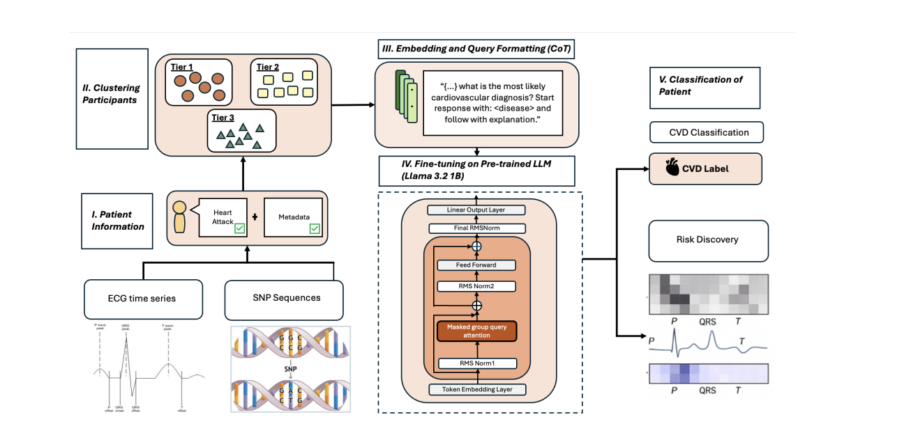

Menon N, Li Y, Farooq I, Ahmed S, Awais M, Razzak I, [*arXiv*](https://arxiv.org/abs/2510.16536)

## Paper summary 

Cardiovascular disease (CVD) risk stratification remains a major challenge due to its multifactorial nature and limited availability of high-quality labeled datasets. While genomic and electrophysiological data such as SNP variants and ECG phenotypes are increasingly accessible, effectively integrating these modalities in low-label settings is non-trivial. This challenge arises from the scarcity of well-annotated multimodal datasets and the high dimensionality of biological signals, which limit the effectiveness of conventional supervised models. To address this, we present a few-label multimodal framework that leverages large language models (LLMs) to combine genetic and electrophysiological information for cardiovascular risk stratification. Our approach incorporates a pseudo-label refinement strategy to adaptively distill high-confidence labels from weakly supervised predictions, enabling robust model fine-tuning with only a small set of ground-truth annotations. To enhance the interpretability, we frame the task as a Chain of Thought (CoT) reasoning problem, prompting the model to produce clinically relevant rationales alongside predictions. Experimental results demonstrate that the integration of multimodal inputs, few-label supervision, and CoT reasoning improves robustness and generalizability across diverse patient profiles. Experimental results using multimodal SNP variants and ECG-derived features demonstrated comparable performance to models trained on the full dataset, underscoring the promise of LLM-based few-label multimodal modeling for advancing personalized cardiovascular care.

##