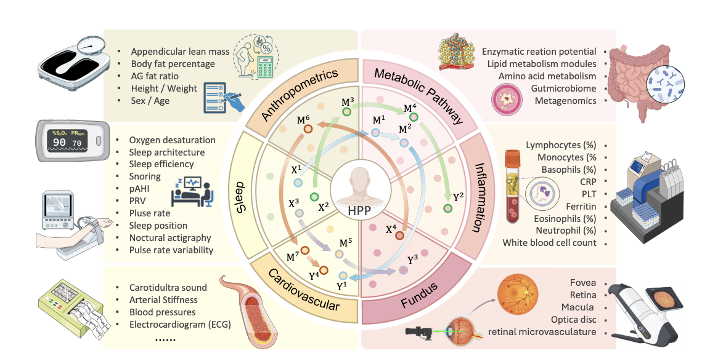

Yulong Li, Xiwei Liu, Feilong Tang, Zhixiang Lu, Ming Hu, Yichen Li, Haochen Xue, Peixin Guo, Jionglong Su, Yutong Xie, Eran Segal, Imran Razzak, [*ICLR*](https://openreview.net/forum?id=I43IOiimO6)

 

## Paper summary

Cross-modal representation learning is fundamental for extracting structured information from multimodal data to enable semantic understanding and reasoning. However, current methods optimize statistical objectives without explicit causal constraints, where nonlinear mappings can introduce spurious dependencies or eliminate critical mediators, leading to representation-induced structural drift that undermines the reliability of causal inference. Therefore, establishing theoretical guarantees for causal invariance in cross-modal representation learning remains a foundational challenge. To this end, we propose Causal Alignment and Representation Learning (CARL), which explicitly embeds causal structure preservation constraints into cross-modal alignment objectives. Specifically, CARL introduces a multi-consistency loss architecture that jointly optimizes conditional independence preservation and information bottleneck regularization to balance cross-modal compression with critical variable retention, ensuring low-density modalities are not masked by high-density reconstruction demands. We further incorporate monotonic alignment consistency loss to establish correspondence between semantic similarity and representation distance through Spearman correlation, and Markov boundary preservation loss to maintain identifiability conditions including backdoor, frontdoor, and instrumental variable criteria in the shared representation space. In synthetic experiments with known causal ground truth, CARL achieves state-of-the-art performance in preserving conditional independence patterns and maintaining causal query identifiability under structural uncertainty. Real-world validation on Human Phenotype Project data reveals that CARL successfully preserves causal structures between fundus vascular representations and cardiovascular events, demonstrating its capacity for reliable cross-modal causal inference in complex biomedical applications.

