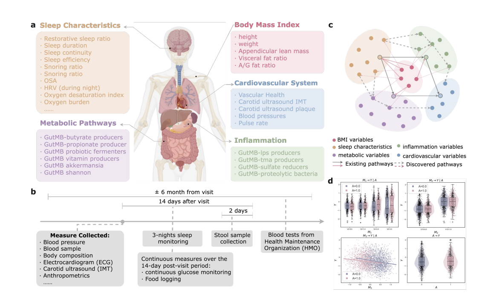

Yulong Li, Xiwei Liu, Feilong Tang, Ming Hu, Jionglong Su, Zongyuan Ge, Imran Razzak, Eran Segal, [*NeurIPS*](https://openreview.net/forum?id=3Sk8CaQWdv)

 

## Paper summary 

Causal mediation analysis is crucial for deconstructing complex mechanisms of action. However, in current mediation analysis, complex structures derived from causal discovery lack direct interpretation of mediation pathways, while traditional mediation analysis and effect estimation are limited by the reliance on pre-specified pathways, leading to a disconnection between structure discovery and causal mechanism understanding. Therefore, a unified framework integrating structure discovery, pathway identification, and effect estimation systematically quantifies mediation pathways under structural uncertainty, enabling automated identification and inference of mediation pathways. To this end, we propose Structure-Informed Guided Mediation Analysis (SIGMA), which guides automated mediation pathway identification through probabilistic causal structure discovery and uncertainty quantification, enabling end-to-end propagation of structural uncertainty from structure learning to effect estimation. Specifically, SIGMA employs differentiable Flow-Structural Equation Models to learn structural posteriors, generating diverse Directed Acyclic Graphs (DAGs) to quantify structural uncertainty. Based on these DAGs, we introduce the Path Stability Score to evaluate the marginal probability of pathways, identifying high-confidence mediation paths. For identified mediation pathways, we integrate Efficient Influence Functions with Bayesian model averaging to fuse within-structure estimation uncertainty and between-structure effect variation, propagating uncertainty to the final effect estimates. In synthetic data experiments, SIGMA achieves state-of-the-art performance in pathway identification accuracy and effect quantification precision under structures uncertainty, concurrent multiple pathways, and nonlinear scenarios. In real-world applications using Human Phenotype Project data, SIGMA identifies mediation effects of sleep quality on cardiovascular health through inflammatory and metabolic pathways, uncovering previously unspecified multiple mediation paths.

