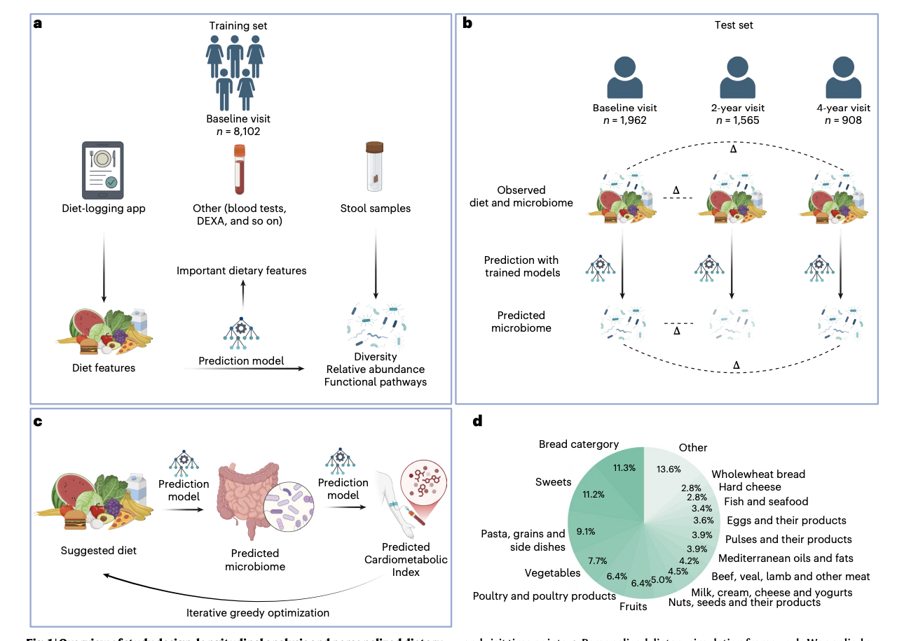

Segev T, Barak D, Zahavi L, Godneva A, Rein M, Krongauz D, Samocha-Bonet D, Rossman H, Weinberger A, Segal E, [*Nature Medicine *](http://doi.org/10.1038/s41591-026-04312-x)

## Paper summary 

Diet is a major environmental factor influencing the human gut microbiome. However, the effects of specific foods and dietary patterns on microbial composition, diversity and function is not fully understood, limiting progress toward personalized dietary strategies. Here, leveraging 10,068 participants from the Human Phenotype Project with app-based diet logs and shotgun metagenomics, we predicted diet–microbiome associations at species-level resolution. Diet significantly predicted microbial diversity (richness r = 0.26, Shannon Index r = 0.24), the relative abundance of 669 of 724 species tested (92.4%, false discovery rate <0.05), and 313 of 320 pathways (97.8%, false discovery rate <0.05). Feature attribution identified distinct food–microbe links, including coffee with Lawsonibacter asaccharolyticus (r = 0.43), yogurt with Streptococcus thermophilus (r = 0.42) and milk with Bifidobacterium species (r = 0.31–0.36). In parallel, broader dietary patterns, especially the degree of food processing, emerged as predictors of microbial diversity and composition. We also show that diet–microbiome associations persist over four years, with 82.5% of species exhibiting significant longitudinal tracking between predicted and observed abundances. Finally, we developed an exploratory analysis for simulating personalized dietary interventions with predicted microbiome shift effects that are associated with improvements in cardiometabolic health. Our findings demonstrate that diet is strongly associated with microbiome composition, diversity and function, and highlight its potential for guiding personalized interventions.

