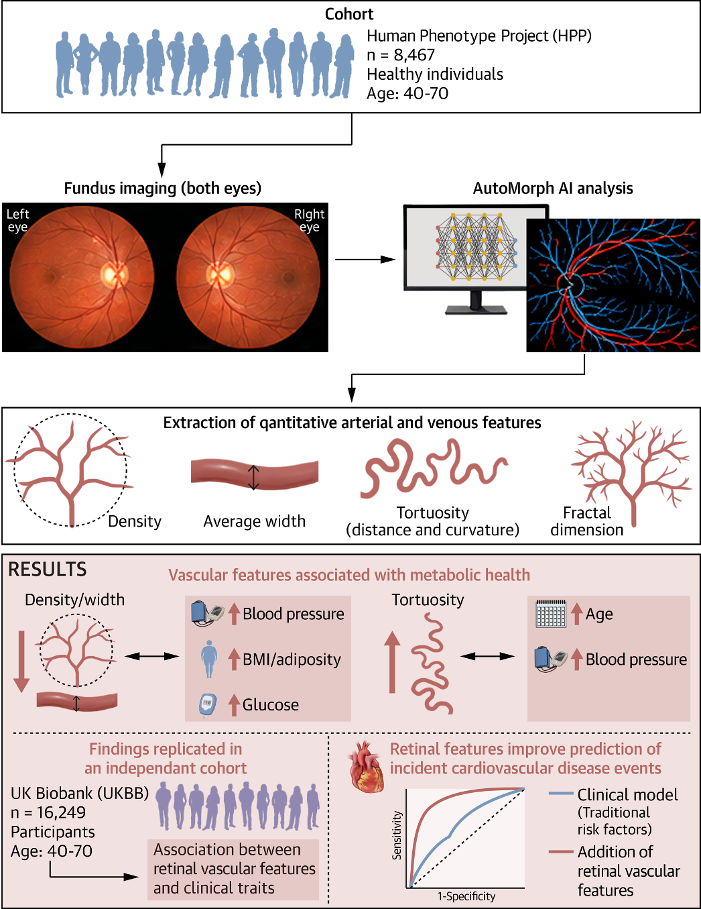

Talmor-Barkan Y, Shapira M, Shilo S, Gorodetski M, Azouri D, Aviv Y, Reisner Y, Godneva A, Weinberger A, Skaat A, Loewenstein A, Berkowitz E, Kornowski R, Segal E, Rossman H, [*JACC: Basic to Translational Science*](https://doi.org/10.1016/j.jacbts.2026.101596)

## Paper summary

Fundus imaging enables noninvasive, high-resolution visualization of the retinal microvasculature. Advances in AI now allow extraction of quantitative vascular metrics from retinal images, offering new opportunities for identifying systemic health biomarkers. This study characterized retinal microvascular features in a large healthy population and assessed their associations with diverse clinical phenotypes, and evaluated their ability to predict incident cardiovascular events. The authors analyzed fundus photographs from 8,467 healthy individuals aged 40–70 enrolled in the Human Phenotype Project, with external validation using fundus images from 16,249 UK Biobank participants. Using an automated AI tool (AutoMorph), they extracted 12 quantitative vascular metrics (e.g. vessel density, average width, fractal dimension, distance and curvature tortuosity), separately for arteries and veins, and derived age- and sex-stratified reference values. Retinal vascular features showed strong age- and sex-related patterns and multiple significant associations with systemic traits. Arterial features were particularly associated with cardiometabolic factors — blood pressure, lipid profiles, glycemic indices, body composition (BMI, fat mass) — and with sleep apnea parameters. Findings replicated in UK Biobank and showed prognostic value for incident cardiovascular events (AutoMorph model AUC 0.841 vs. baseline clinical model AUC 0.567). This large-scale, AI-driven study provides normative data on retinal vascular traits and supports fundus imaging for systemic risk stratification, reinforcing the emerging role of oculomics in predictive and preventive healthcare.

