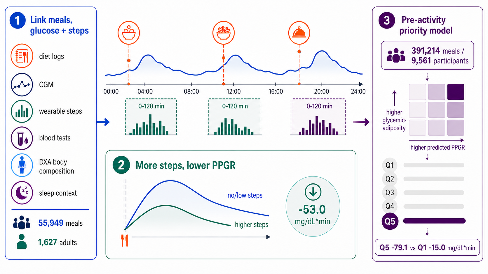

Shilo S, Sapir G, Lutsker G, Talmor-Barkan Y, Godneva A, Diament A, Matabuena M, Segal E, Rossman H, [*medRxiv*](https://doi.org/10.64898/2026.06.22.26356272)

## Paper summary

Post-meal activity can attenuate glucose excursions, but the exact magnitude of this effect remains unquantified, and guidance is rarely personalized to the meal occasion. The authors linked Human Phenotype Project diet logs, continuous glucose monitoring, and wearable step counts to test whether glycemic risk estimated *before* activity occurs can prioritize post-meal movement. An activity-blind PPGR model trained on 391,214 PPGR-valid meals from 9,561 participants generated pre-activity meal scores. Among 55,949 step-linked meals from 1,627 adults without diabetes, higher 0–120-min post-meal steps were associated with lower within-participant PPGR (−53.0 mg/dL·min per 1 s.d. higher log steps; 95% CI, −64.2 to −41.7), with larger adjusted PPGR iAUC contrasts at 1,501–2,500 observed steps (−154.4 mg/dL·min vs 0–50 steps). Associations were stronger among participants with higher glycemic-adiposity burden and after meals with higher predicted PPGR. A held-out pre-activity step-response ranking concentrated larger inverse step–PPGR associations (−79.1 top vs −15.0 mg/dL·min bottom quintile), providing a testable strategy for prediction-guided, post-meal movement prompts.

