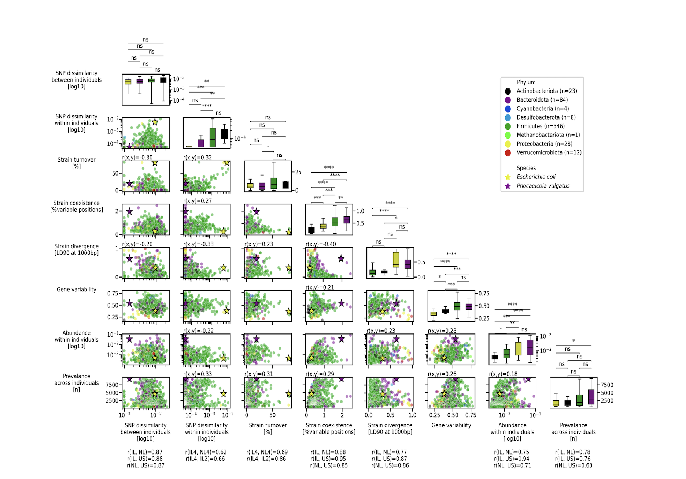

Shoer S, Godneva A, Weinberger A, Pollard K, Pilpel Y, Segal E, [*BioRxiv*](https://doi.org/10.1101/2025.11.30.691432)

 

## Paper summary 

The human microbiota influences host physiology, yet much of its complexity lies beneath the species level. Here, we analyzed the intra-species genetic diversity of 936 gut bacteria across 24,997 individuals from three countries. Our findings show that highly abundant species exhibit greater strain stability, whereas low-abundance species display increased in-clonal mutations. Clonal strains are often mutually exclusive, while genetically variable strains tend to coexist. Strain turnover is associated with the presence of annotated chemotaxis and sporulation genes in reference genomes, whereas strain coexistence is associated with quorum sensing and secretion systems. Leveraging deep phenotypic data, we constructed an atlas detailing strain-level associations with diverse host physiological domains. For example, *Phocaeicola vulgatus* sub-types relate to host obesity, *Lachnospira eligens* to sleep, and *Parabacteroides distasonis* to iron hemostasis. This resource may guide personalized microbiome-based interventions to improve human health.

